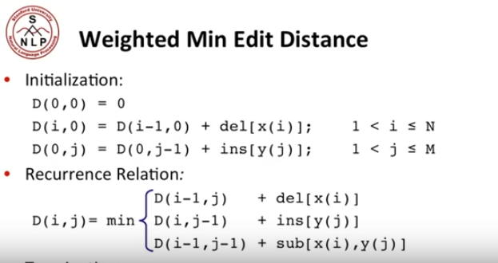

### course 3-1
	Minimun edit distance
		最小编辑距离
			only allowed: insertion, deletion, substitution
			动态规划
		Machine translatoin and speech recognition
			机器翻译和拼写检查

### course 3-2
	用动态规划计算最小编辑距离

### course 3-3
	dynamic programming Not sufficient->
		computing alignment	

### course 3-4
    
	weighted edit distance

### course 3-5
	计算生物学
		Needleman-Wunsch Algorithm
			交叉overlap detection variant

		Smith-Waterman algorithm
