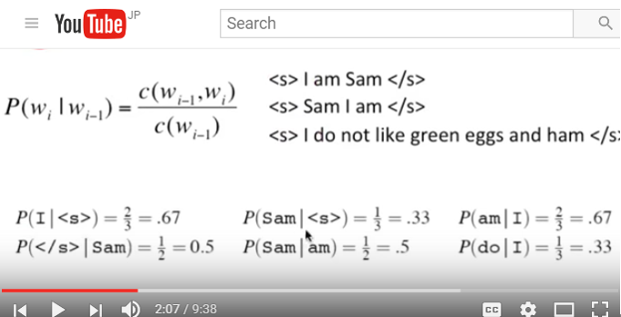
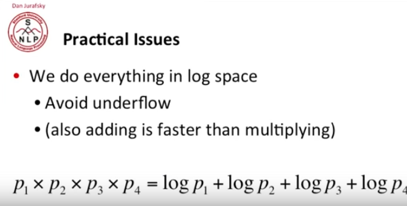
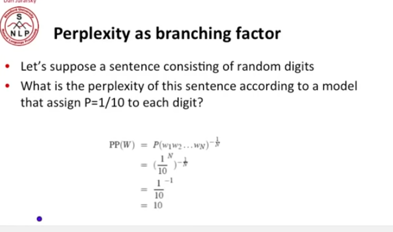
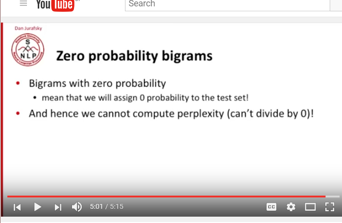
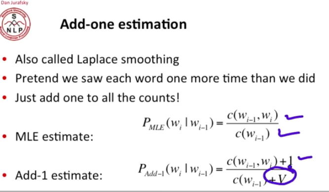
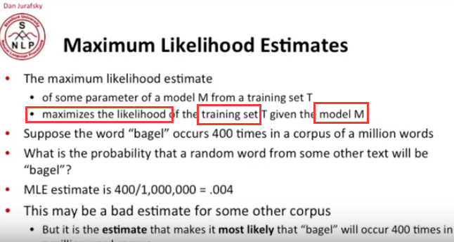

### course 4-1
	N-grams
	Probabilistic Language Modeling
		P(high winds tonite) > P(large winds tonite)
	Chain Rule
贝叶斯链式规则
	Markov Assumption
		简化假设

	https://books.google.com/ngrams
Google迄今已扫描了大约一千五百万册图书......用Ngrams可以查单词。比如，讨人厌的"problematize"，一查果然是近年（2011））才泛滥的。又如，文绉绉的拉丁文词组，20世纪大大减少......
	
###	4.3
	Evaluation and Perplexity 评估和困惑度
	计算公式:

 
	MT System: 机器翻译系统
###	4.4
	Generalization and Zeros
		bigrams 应该指二词同现,语法频率是一个稀疏图
		有些地方会遇到perplexity无法计算，因为要除以0

 

###	4.5
	intuition of smoothing（from Dan Klein）
	为了计算分母为0（概率为0）的perplexity：

 
	最大似然估计：做出一个估计取最大可能性的结果（废话）

局限性：

 
###	4.6		interpolation
	pruning: 
    1. N-grams with count> threshold 2. entropy-based pruning
	stupid backoff
	Only use relative frequencies to represent probability
	The most used algorithm:	Extended Interpolated Kneser-Ney
	discriminative models:

###	4.7 Good Turing Smoothing
	Three Advanced algorithms: Witten-Bell, Good-Turing, Kneser-Ney
	一种平滑的统计词频的方法
	4.8 Kneser Ney
	连续性词语的出现导致的单词语预测错误？
	{{wi-1:c(wi-1, w)>0}}
